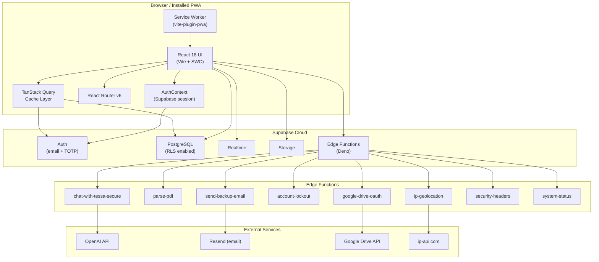
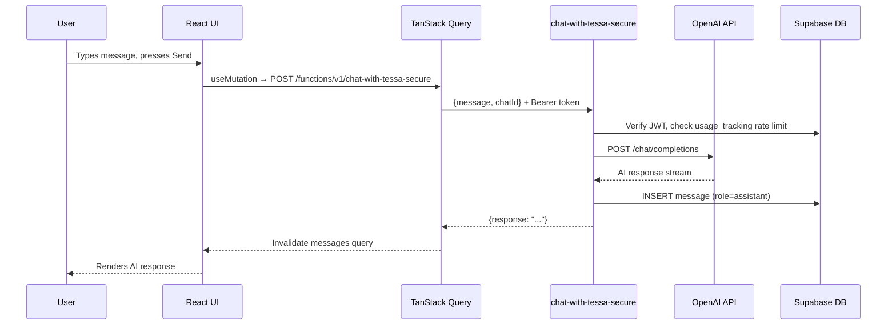
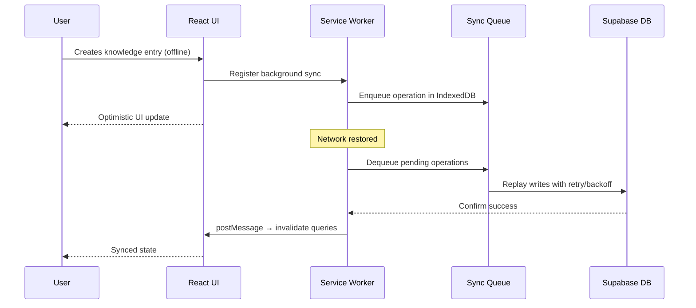
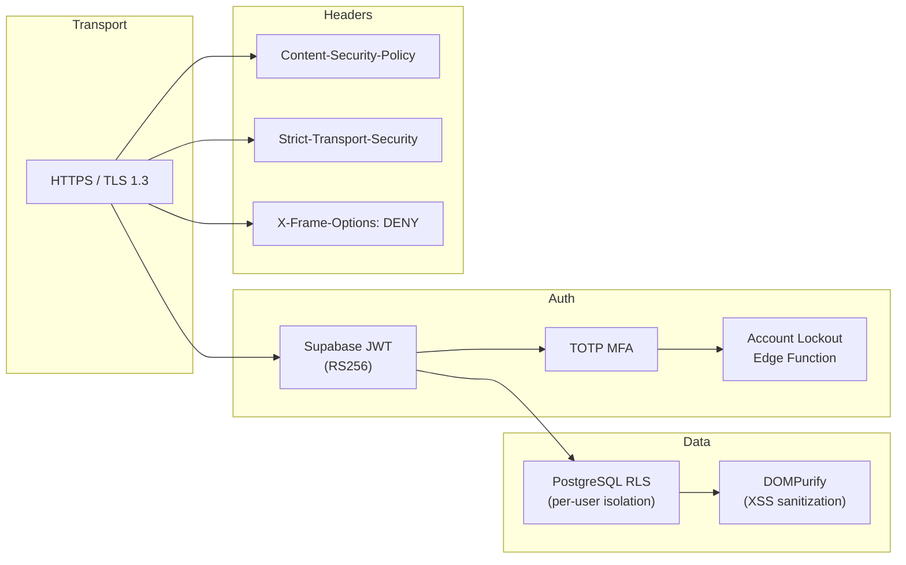

# Architecture — Cortex Second Brain

## Overview

Cortex Second Brain is a client-heavy Progressive Web App (PWA) backed by Supabase. The frontend is built with React 18 + TypeScript, communicates directly with Supabase (PostgreSQL, Auth, Realtime) via the JS SDK, and offloads compute-intensive or privileged operations to Deno-based Supabase Edge Functions.

---

## System Architecture Diagram



---

## Layer Breakdown

### 1. Presentation Layer (`src/components/`, `src/pages/`)

- **Pages** (`src/pages/`): Route-level components, one per route. Thin orchestrators — they compose feature components, call hooks, and handle route params.
- **Components** (`src/components/`): Organised by domain: `auth/`, `knowledge/`, `tessa/`, `admin/`, `settings/`, `landing/`, `ui/` (shadcn primitives), etc.
- **Animations**: Framer Motion 12 with layout transitions and entrance animations.
- **Command Palette**: `cmdk` library, available globally via `Ctrl+K`.

### 2. State & Data Layer

| Concern | Solution |
|---|---|
| Server state / async data | TanStack Query 5 (queries, mutations, invalidation) |
| Auth session | `AuthContext` (wraps `supabase.auth`, stored in `localStorage`) |
| Local UI state | React `useState` / `useReducer` |
| Offline queue | Custom background sync via Service Worker + IndexedDB |

### 3. Service Layer (`src/services/`)

All database access is encapsulated in service classes that extend `BaseService`. Services return typed results and throw `ApplicationError` on failure.

```
BaseService
├── KnowledgeService    – CRUD for knowledge_base table
├── ChatService         – CRUD for chats + messages tables
├── SearchService       – Full-text and semantic search
├── UserService         – user_profiles + user_roles
├── NotificationService – notifications table
├── AdminService        – admin-level queries (rate limits, usage)
└── AuditService        – profile_access_logs
```

### 4. Edge Functions (Deno / Supabase)

Privileged or compute-intensive operations are handled server-side:

| Function | Auth Required | Key Dependency |
|---|---|---|
| `chat-with-tessa-secure` | Yes | OpenAI, `usage_tracking` |
| `parse-pdf` | No | Native Deno PDF parser |
| `send-backup-email` | Yes | Resend API |
| `account-lockout` | Service role | `login_attempts` table |
| `google-drive-oauth` | Yes | Google OAuth 2.0 |
| `ip-geolocation` | Yes | ip-api.com |
| `security-headers` | No | — |
| `system-status` | No (admin detail) | Supabase service role |

### 5. Database (PostgreSQL + RLS)

All tables enforce Row Level Security. Users can only read/write their own rows. Admin access is gated by `has_role('admin')` RPC check.

See [DATABASE.md](DATABASE.md) for full schema.

### 6. PWA / Offline

- Service worker generated by `vite-plugin-pwa` (Workbox).
- Caching strategies:
  - **Fonts** → CacheFirst
  - **Images** → CacheFirst
  - **JS/CSS bundles** → StaleWhileRevalidate
  - **Supabase API calls** → NetworkFirst with 10s timeout
- Offline fallback route: `/offline`
- Background sync queue retries failed writes when connectivity is restored.

---

## Data Flow — TESSA AI Chat



---

## Data Flow — Offline Write



---

## Security Architecture



---

## Build & Bundle

Vite code-splitting produces the following chunks:

| Chunk | Contents |
|---|---|
| `react-vendor` | `react`, `react-dom`, `react-router-dom` |
| `ui-vendor` | `@radix-ui/*`, `framer-motion`, `lucide-react` |
| `supabase` | `@supabase/supabase-js` |
| `query` | `@tanstack/react-query` |
| `charts` | `recharts` |

Dev server runs on **port 8080**.

---

## Error Handling

All service errors are wrapped in `ApplicationError` which implements `AppError`:

```typescript
enum ErrorCode {
  UNKNOWN, VALIDATION, NOT_FOUND, UNAUTHORIZED,
  FORBIDDEN, NETWORK_ERROR, TIMEOUT, DATABASE,
  CONFLICT, SERVICE_UNAVAILABLE, RATE_LIMITED
}
```

TanStack Query retries network errors automatically (configured via `ApiConfig.maxRetries`).
